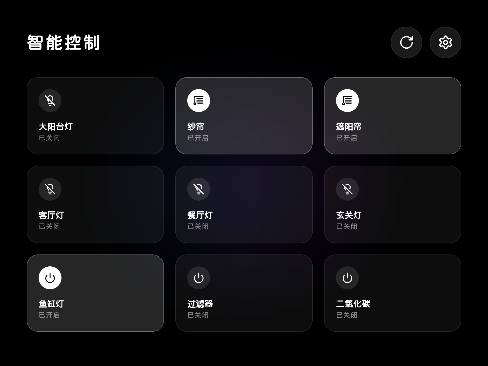
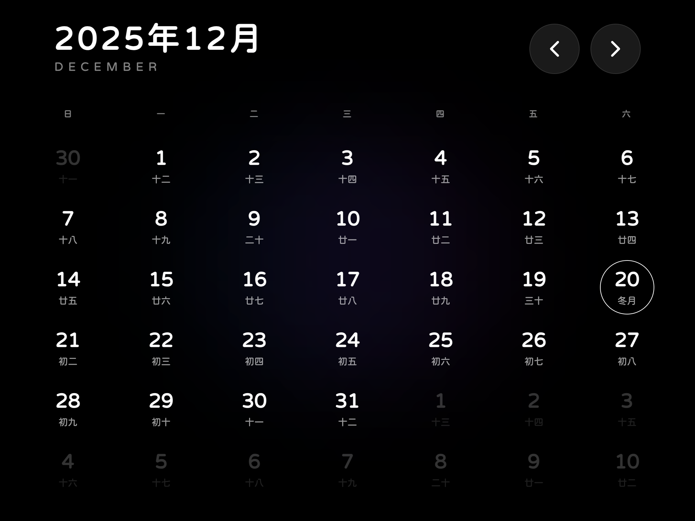

# Clock Dashboard | 精美天气时钟看板

[](LICENSE)
[](https://vuejs.org/)
[](https://vitejs.dev/)

一个基于 Vue 3 + TypeScript + Vite + Tailwind CSS 构建的精美天气时钟看板。专为旧平板（如 iOS 12 的 iPad）优化，支持 PWA 离线运行和 Home Assistant 智能家居控制。

---

## 🌟 特性

- **动态数字时钟**：支持滚动动画和随机倾斜效果，模拟手写/艺术字感。
- **实时天气**：基于地理位置或 IP 自动获取天气、温度、湿度及风速。
- **农历信息**：集成 `lunar-typescript`，提供精准的农历、干支年及节日显示。
- **全屏日历**：内置万年历视图，支持月份切换及今天快速跳转。
- **智能家居控制**：深度集成 Home Assistant，支持灯光、开关、窗帘电机（Cover）等设备的实时控制与状态同步。
- **极致兼容性**：针对 iOS 12+ 进行了大量 CSS 补丁修复（如 Flex Gap、Backdrop Filter 等）。
- **PWA 支持**：支持 iOS "添加到主屏幕"，全屏沉浸式体验，无地址栏。
- **JSON 配置**：智能设备支持一键 JSON 导入/导出，方便跨设备同步配置。

## 📸 预览

### 1. 主控制台


### 2. 智能家居控制


### 3. 全屏日历


---

## 🛠️ 技术栈

- **框架**: [Vue 3 (Composition API)](https://vuejs.org/)
- **构建工具**: [Vite 5](https://vitejs.dev/)
- **语言**: [TypeScript](https://www.typescriptlang.org/)
- **样式**: [Tailwind CSS 3](https://tailwindcss.com/)
- **图标**: [Lucide Vue Next](https://lucide.dev/)
- **兼容性**: [@vitejs/plugin-legacy](https://github.com/vitejs/vite/tree/main/packages/plugin-legacy) (针对旧版 Safari)
- **字体**: [Fontsource](https://fontsource.org/) (本地托管 Cherry Bomb One, Huninn)

---

## 🚀 快速开始

### 1. 克隆项目
```bash
git clone https://github.com/your-username/clock-dashboard.git
cd clock-dashboard
```

### 2. 安装依赖
```bash
pnpm install
```

### 3. 本地开发
```bash
pnpm dev
```
服务将运行在 `http://localhost:3000`。

### 4. 生产打包
```bash
pnpm build
```
打包产物将生成在 `dist` 目录中。

---

## ⚙️ 智能家居配置

在应用中点击右上角设置图标，可以配置您的 Home Assistant 信息：

1. **HA 地址**：例如 `http://192.168.1.100:8123`
2. **长期访问令牌**：在 HA 个人设置页底部生成。
3. **JSON 模式**：您可以直接粘贴以下格式进行批量配置：
```json
{
  "url": "http://your-ha-url:8123",
  "token": "your-long-lived-access-token",
  "entities": [
    { "id": "light.living_room", "name": "客厅灯" },
    { "id": "cover.bedroom_curtain", "name": "卧室窗帘" }
  ]
}
```

## 📄 开源协议

本项目采用 [MIT License](LICENSE) 协议。
